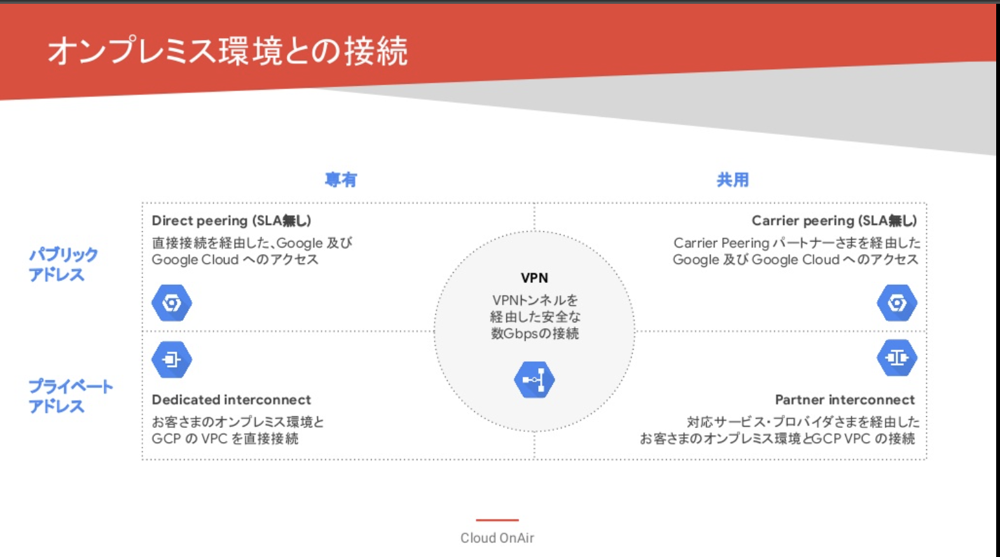
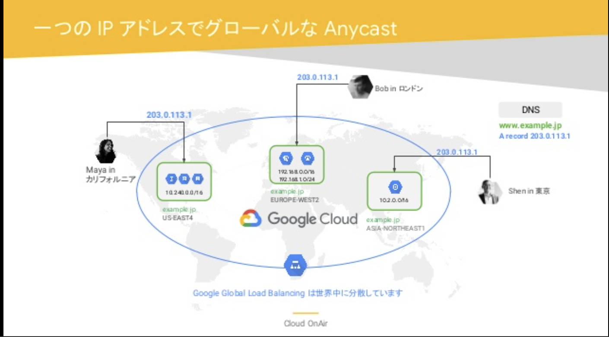

## DB
### Cloud SQL
Cloud SQLはリレーショナルデータベースですが、マルチリージョン構成をサポートしていません。

### DataStore
* [クイックスタート](https://cloud.google.com/datastore/docs/quickstart)
* [復習：ACID特性](https://ja.wikipedia.org/wiki/ACID_(%E3%82%B3%E3%83%B3%E3%83%94%E3%83%A5%E3%83%BC%E3%82%BF%E7%A7%91%E5%AD%A6)) 

### BQ
BigQueryは複数ステートメントのトランザクションはサポートされていません。
BigQueryのアクティブストレージ料金は、Cloud Storage Nearlineストレージよりも高価です。

### Cloud Filestore 
[Cloud Filestore](https://cloud.google.com/filestore)は、データ用のファイルシステムインターフェースと共有ファイルシステムを必要とするアプリケーション向けのマネージドファイルストレージ サービスです。 Cloud Filestore ではファイルロックはサポートされます。

## GCS
[gsutil versioning set](https://cloud.google.com/storage/docs/gsutil/commands/versioning)

## GCE
### カスタム マシンタイプ
[カスタム マシンタイプの VM インスタンスを作成する](https://cloud.google.com/compute/docs/instances/creating-instance-with-custom-machine-type#gcloud)

N1 マシンタイプの場合は、gcloud compute instances create コマンドを使用して次のいずれかのオプションを指定します。
* --custom-cpu と --custom-memory フラグ。
* --machine-type=custom-[NUMBER_OF_CPUS]-[NUMBER_OF_MB] 

### OSログイン
[OSログイン](https://cloud.google.com/compute/docs/oslogin)を使用するとIAMの役割を使用してLinuxインスタンスへのSSHアクセスを管理できます。

### ヘルスチェック
[ヘルスチェックと自動修復の設定](https://cloud.google.com/compute/docs/instance-groups/autohealing-instances-in-migs)

### リソース種類

> [Compute Engine のすべてのリソース](https://cloud.google.com/compute/docs/regions-zones/global-regional-zonal-resources?hl=ja-JPFactory)は、グローバル、リージョン、ゾーンに分類されます。たとえば、イメージはグローバル リソースですが、永続ディスクはリージョン リソースまたはゾーンリソースのいずれかです。

抽象度が高いものが、グローバルリソースに分類される。

> リソースのスコープにより、アクセス可能なリソースが決まります。たとえば、グローバル リソースには任意のリージョンまたはゾーンのリソースからアクセスできます。つまり、仮想マシン（VM）インスタンスが別のゾーンにあったとしても、それらは同じグローバル イメージを使用できます。

スコープが限定されているものから、開放されているものへのアクセスは可能だが、逆は不可。

> リージョン リソースにアクセスできるのは、同じリージョン内のリソースだけです。たとえば、リージョンの静的外部 IP アドレスにアクセスできるのは、同じリージョンのリソースだけです。VM インスタンスが特定の静的外部 IP アドレスを使用するには、当該アドレスと同じリージョン内のゾーンにそのインスタンスを置く必要があります。

> リソースのスコープは、アクセス可能なリソースの範囲を表します。ただし、グローバル、ゾーン、リージョンに関係なく、どのリソースもプロジェクト内で一意でなければなりません。つまり、Compute Engine 内のリソースにはプロジェクト全体で一意の名前を付ける必要があります。たとえば、us-central1-a で VM インスタンス example-instance に名前を付け、同じプロジェクト内の別の VM に同じ名前を付けることはできません。

リソーススコープは名前空間としては機能していない。

## GAE
トラフィックを新しいバージョンに移行するには、gcloud app versions migrate [新しいバージョン] コマンドを実行します。

## GKE
Deploymentを使用してServiceを公開するには、kubectl expose deploymentコマンドで、--type、--port、--target-portパラメータを使用します。

[kubeconfig エントリの生成](https://cloud.google.com/kubernetes-engine/docs/how-to/cluster-access-for-kubectl#generate_kubeconfig_entry)

## Trace
[Stackdriver トレース](https://cloud.google.com/trace)はアプリケーション内でやり取りされるリクエストを追跡し、ほぼリアルタイムでパフォーマンスの分析情報を提供します。アプリケーションのトレースを自動的に分析し、パフォーマンス低下の原因となるレイテンシの詳細レポートを生成します。

## 予算アラート

[請求のロール](https://cloud.google.com/iam/docs/understanding-roles?hl=ja#billing-roles)
* Billing Account Administrator
* Billing Account User

## Cloud HSM
[概要](https://cloud.google.com/security-key-management)

## DM
[構成をプレビューする](https://cloud.google.com/deployment-manager/docs/configuration/preview-configuration-file)

* あまり触ったことがないので、この[チュートリアル](https://cloud.google.com/deployment-manager/docs/quickstart)をやっておく。
* [traformのチュートリアル](https://learn.hashicorp.com/collections/terraform/gcp-get-started)もやっておく。

## VPC
[TGハイブリットクラウドセミナー](https://www.topgate.co.jp/200622-hybridcloud-seminar-report)

* [自動モード](https://cloud.google.com/vpc/docs/using-vpc?hl=ja-JPFactory)
デフォルトは自動モード。VPCの中に一つのサブネットが作成される。
サブネットのIP範囲は自動で定義されている。
本番環境ではこれは使わない方が良い。IP範囲がかぶったりすると困るので。

サブネットが定義されていないリージョンにインスタンスは作成できません。

自動モード VPC ネットワークを作成すると、各リージョンから 1 つのサブネットがネットワーク内に自動的に作成されます。このような自動作成されたサブネットでは、一連の事前定義された IP 範囲（10.128.0.0/9 CIDR ブロック）が使用されます。Google Cloud の新しいリージョンが利用可能になると、そのブロックの IP 範囲を使用して、リージョン内で新しいサブネットが自動モード VPC ネットワークに自動的に追加されます。自動作成されるサブネットに加え、10.128.0.0/9 以外の IP 範囲を使用して、選択したリージョン内でサブネットを自動モード VPC ネットワークに手動で追加できます。

カスタムモード VPC ネットワークを作成すると、サブネットは自動的に作成されません。この種類のネットワークでは、そのサブネットと IP 範囲を完全に制御できます。選択したリージョン内で、指定した IP 範囲を使用して、作成するサブネットを決定します。

* [カスタムルートのインポートとエクスポート](https://cloud.google.com/vpc/docs/vpc-peering#importing-exporting-routes)

* [ルートアドバタイズ](https://cloud.google.com/network-connectivity/docs/router/concepts/overview#route-advertisement)

* [Cloud VPN と Cloud Interconnect](https://cloud.google.com/network-connectivity/docs/how-to/choose-product?hl=ja)

VPCピアリングを利用すると、同じプロジェクトまたは組織に属しているかどうかに関わらず、２つの Virtual Private Cloud（VPC）ネットワーク間でプライベート RFC1918接続を確立できます。トラフィックはGoogleのネットワーク内に留まり、公共のインターネットを経由することはありません。
  

  

### ネットワーク
* [ネットワーク・トポロジー](https://ja.wikipedia.org/wiki/%E3%83%8D%E3%83%83%E3%83%88%E3%83%AF%E3%83%BC%E3%82%AF%E3%83%BB%E3%83%88%E3%83%9D%E3%83%AD%E3%82%B8%E3%83%BC)
* [エニーキャスト](https://ja.wikipedia.org/wiki/%E3%82%A8%E3%83%8B%E3%83%BC%E3%82%AD%E3%83%A3%E3%82%B9%E3%83%88)
一番近いノードに情報をおくる仕組み。エニーキャストアドレスというのも複数のノードで共有しておくらしい。
他に、ユニキャスト、マルチキャスト、ブロードキャスト

## LoadBlancing

  

### コンテキストに基づくアクセス制御とは
コンテクスト
* ユーザー ID
* アクセス元の地域
* デバイスのセキュリティ状況
* IP アドレスなどの属性

[コンテキスト アウェア アクセス](https://support.google.com/a/answer/9275380?hl=ja)

ユースケースの例
* 会社支給のデバイスのみにアプリへのアクセスを許可する。
* ユーザーのストレージ デバイスが暗号化されている場合にのみ、ドライブへのアクセスを許可する。
* 社外ネットワークからのアプリへのアクセスを制限する。

## Cloud Router
[Cloud Router](https://cloud.google.com/network-connectivity/docs/router) では、ボーダー ゲートウェイ プロトコル（BGP）を使用することで、Virtual Private Cloud（VPC）ネットワークとオンプレミス ネットワーク間でルートを動的に交換できます。例えば、オンプレミスサーバーとのVPNトンネルに使用する場合、Cloud RouterはVPC ネットワーク内の新しいサブネットを自動的に学習し、オンプレミス ネットワークに通知します。

[Google Cloud システムの設計上の考慮事項](https://cloud.google.com/architecture/framework/design-considerations?hl=ja)

